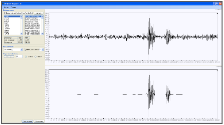

# WaveletApplication

A Windows desktop application for discrete wavelet transform (DWT) analysis of one-dimensional signals. Supports both offline (file-based) decomposition and real-time streaming wavelet processing.



*The top panel shows the raw input signal; the bottom panel shows the detail (high-frequency) coefficients produced by multi-level DWT decomposition.*

---

## Background: Wavelets and Signal Processing

### What is a Wavelet Transform?

The **Discrete Wavelet Transform (DWT)** decomposes a signal into components at different frequency scales and time locations — unlike the Fourier transform, which only reveals frequency content without temporal information. This makes wavelets especially useful for analysing non-stationary signals (e.g. seismic data, ECG, speech) where frequency content changes over time.

At each decomposition level the signal is passed through two complementary filters:

| Filter | Symbol | Output |
|--------|--------|--------|
| Low-pass (analysis) | H0 | Approximation coefficients (**CA**) — coarse signal |
| High-pass (analysis) | H1 | Detail coefficients (**CD**) — fine/edge content |

After filtering, each output is **downsampled by 2** (Nyquist sub-sampling), halving the number of samples. Multi-level decomposition applies this process recursively to the approximation coefficients, building a tree of frequency sub-bands.

**Reconstruction** (IDWT) is the mirror operation: upsample each sub-band, apply synthesis filters (F0, F1), and sum the results. Perfect reconstruction is guaranteed when the filter bank satisfies the quadrature mirror filter (QMF) conditions.

### Mallat Algorithm

This application implements the **Mallat pyramidal algorithm** (1989), the standard fast wavelet algorithm with O(N) complexity. The filter bank at each level is:

```
Signal ──┬── [H0] → ↓2 → CA  (approximation)
         └── [H1] → ↓2 → CD  (detail)
```

### Daubechies Wavelets

The application ships with two Daubechies wavelets defined as XML coefficient files:

- **Daubechies 2** (db2) — 4-tap filter; shortest Daubechies wavelet with one vanishing moment beyond Haar. Good time resolution.
- **Daubechies 6** (db6) — 12-tap filter; smoother, more vanishing moments, better frequency selectivity at the cost of longer support.

Both are **orthogonal** wavelets, ensuring energy preservation and perfect reconstruction.

### Running (Streaming) DWT

The second application mode implements a **Running DWT** — a causal, sample-by-sample transform suitable for real-time streaming signals. A circular buffer accumulates incoming samples; once a sufficient segment (the *wavelet phase*, computed from filter length and decomposition depth) is available, a short convolution produces a new coefficient. The phase delay (the number of samples that must pass before the first valid coefficient of a given level can be computed) is accounted for explicitly.

---

## Applications

### WaveletApplication — Static Analysis

- Load a signal from a plain-text file (values separated by `;`, using the system decimal separator)
- Select a wavelet and decomposition depth from the sidebar
- View approximation and detail coefficients on synchronised, scrollable charts
- Apply threshold denoising (`WThresh`) with soft or hard thresholding
- Reconstruct the signal via IDWT and compare with the original

### RunningWavelet — Real-Time Processing

- Generates a synthetic test signal or configurable sine wave in a background thread
- Applies multi-level running DWT sample-by-sample
- Displays the incoming signal and the selected decomposition level in real time
- Adjustable thread speed and decomposition depth via the settings panel

---

## Building

**Requirements:** Visual Studio 2012 or later, .NET Framework 3.5

Open `WaveletApplication2012.sln` and choose **Build > Build Solution**, or from the command line:

```bash
msbuild WaveletApplication2012.sln /p:Configuration=Release
```

Outputs are placed in each project's `bin\Release\` folder.

---

## Project Structure

```
WaveletApplication/          # Static analysis executable + shared library code
  WaveletTools.cs            # All DWT/IDWT algorithms (DWT, WaveDec, WaveRec, WThresh, …)
  WaveletSettings.cs         # Filter coefficient container (H0, H1, F0, F1)
  WaveletLoader.cs           # Loads WaveletSettings from XML
  ChartTools/ucChart.cs      # Reusable chart UserControl
  WaveletLibrary/            # Wavelet filter definitions (XML)
    Daubechies2.xml
    Daubechies6.xml

RunningWavelet/              # Real-time streaming executable
  WaveletController/
    RunningWaveletController.cs   # MVC controller; owns the generator thread
  RunningProcessor.cs        # Applies decomposition/reconstruction to SignalBuffer
  SignalBuffer.cs            # 2D circular buffer for LF and HF coefficients
  DataGenerators/            # IGenerable, TestSequence, SinGenerator
```

---

## Credits

Original wavelet algorithm implementation by **Ivan Kaliakin** (ELTECH.ru, 2011–2014).